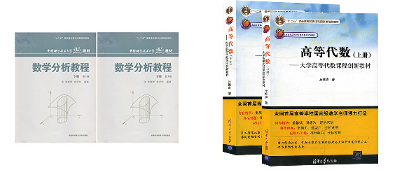

# 数学学习小组

> **大小多少，图难于其易，为大于其细，天下难事，必作于易，天下大事，必作于细。《老子 · 六十三章》**

## 课程
### 作业题目
<table>
  <tr>
    <th>周次</th>
    <th>高等代数（周六晚上7:00）</th>
    <th>数学分析（周日晚上7:00）</th>
  </tr>
  <tr>
    <td>4周（4/22 - 4/28）</td>
    <td>习题2.3:1.(1)(3), 2.(2), 4.(1)  习题2.4:1.(3),2,7,12,13</td>
    <td>练习题1.7: 2, 3.(2)(3), 5  练习题 1.8: 1.(4), 5  问题1.9: 1, 2  练习题 1.10: 1.(3)(6), 2.(1)(2), 3</td>
  </tr>
  <tr>
    <td>5周（4/29 - 5/5）</td>
    <td>习题2.5: 2,4,6 习题2.6: 1,2</td>
    <td>练习题1.11: 1.(1)(2),3,4,5 练习题2.1: 2,4 练习题2.2: 2,4,5</td>
  </tr>
  <tr>
    <td>7周（5/13 - 5/19）</td>
    <td>视频（20-23） 习题3.1: 1,2,3.(2),6,7 习题3.2: 1,2.(2),5,9,12 习题8.1: 1,2,3,7,8,9 习题8.2: 1</td>
    <td>视频（17-20） 练习题2.3: 2,3,4,7,8,9,10 练习题2.4: 1,3.(1), 4.(1)(2)(3)(4), 6,9,11.(3)(4)(5)(7)(8), 12.(1)(3)(5)(7), 14, 15</td>
  </tr>
  <tr>
    <td>8周（5/20 - 5/26）</td>
    <td>视频（24-27） 习题3.1: 1,2,3.(2),6,7 习题3.2: 1,2.(2),5,9,12 习题8.1: 1,2,3,7,8,9 习题8.2: 1</td>
    <td>视频（21-25） 练习题2.3: 2,3,4,7,8,9,10 练习题2.4: 1,3.(1), 4.(1)(2)(3)(4), 6,9,11.(3)(4)(5)(7)(8), 12.(1)(3)(5)(7), 14, 15</td>
  </tr>
  <tr>
    <td>9周（5/27 - 6/2）</td>
    <td>视频（28-31） 习题 3.3：1, 3, 5, 6, 9</td>
    <td>视频（26-29） 练习题2.5：1.(2)(3), 2.(2)(3), 5, 6.(2) ,7  练习题2.6：1.(1)(3)(5)(7)(9)(11), 2, 3  练习题2.7：1, 2.(3)(4), 4, 6, 7, 10  练习题2.8：1.(3)(5), 2.(2)(4), 3.(1)(3)(5)(7)(9)</td>
  </tr>
  <tr>
    <td>10周（6/3 - 6/9）</td>
    <td>视频（32-35） 习题 8.1：10 - 20</td>
    <td>视频（30-34） 练习题 2.9：1.(1)-(4) 2, 3   练习题 2.10：1-8, 10  练习题 2.11：1-3</td>
  </tr>
  <tr>
    <td>11周（6/10 - 6/16）</td>
    <td>视频（36-39） 习题 3.5：2.(1), 4-6, 9-10, 14, 16</td>
    <td>视频（35-38） 练习题 2.12：2, 3  练习题3.1：1, 7, 9-10</td>
  </tr>
  <tr>
    <td>12周（6/17 - 6/23）</td>
    <td>视频（40-43） 习题 3.6：1, 2, 5 习题 1.(3), 2, 5-7</td>
    <td>视频（39-42） 练习题 3.2: 1-10  练习题 3.3: 1.(1)(3)(4)(10),2.(1)(2),3,5</td>
  </tr>
  <tr>
    <td>13周（6/24 - 6/30）</td>
    <td>视频（44-47） 习题 8.2：6, 7, 10, 14, 19, 21, 23</td>
    <td>视频（43-46） 练习题 3.4: 1-2, 3.(1)(4), 6, 8, 10-11  练习题 3.5: 1-2, 3.(2), 5, 7, 9, 13, 15, 18, 19, 22</td>
  </tr>
  <tr>
    <td>14周（7/1 - 7/7）</td>
    <td>视频（48-51） 习题 8.3：1-3, 5, 9, 10</td>
    <td>视频（47-50） 练习题 3.6: 1.(1)-(4)(7)(8)(11)(12), 2-4</td>
  </tr>
  <tr>
    <td>15周（7/8 - 7/14）</td>
    <td>视频（52-55） </td>
    <td>视频（51-54） 练习题 4.1: 1-5</td>
  </tr>
  <tr>
    <td>16周（7/15 - 7/21）</td>
    <td>视频（56-59） 习题 8.4：1-4</td>
    <td>视频（59-63） 练习题 4.2: 1-2 练习题 4.3: 1,2.(2)(3)(5), 3-4</td>
  </tr>
  <tr>
    <td>17周（7/22 - 7/28）</td>
    <td>视频（60-63） </td>
    <td>视频（64-67） </td>
  </tr>
  <tr>
    <td>18周（7/29 - 8/4）</td>
    <td>视频（64-67） 习题 4.1：7,11-14 习题 4.2：8</td>
    <td>视频（68-71） 练习题 6.1: 1-6 练习题 6.2: 2-7 练习题6.3：1.(2)(4), 2-4</td>
  </tr>
  <tr>
    <td>19周（8/5 - 8/11）</td>
      <td>视频（68-71） </td>
      <td>视频（72-75） </td>
  </tr>
  <tr>
    <td>20周（8/12 - 8/18）</td>
    <td>视频（72-75） </td>
    <td>视频（76-79） </td>
  </tr>
  <tr>
    <td>21周（7/29 - 8/4）</td>
    <td>视频（76-79） </td>
    <td>视频（80-83） </td>
  </tr>
</table>

### 课程介绍

共计两门课，使用的教材如下：

1. 《数学分析》，史怀济，中国科学大学
   * 视频：共220讲，[B站视频链接](https://www.bilibili.com/video/av18844091)
   * 教材：《[数学分析教程](https://item.jd.com/13904102457.html)》(上、下册，第三版),常庚哲,史济怀编，高等教育出版社

2. 《高等代数》，丘维声，北京大学
   * 视频：共151讲，[B站视频链接](https://www.bilibili.com/video/av39523603)
   * 教材：《[高等代数—高等代数教程大学数学教材](https://item.jd.com/12426985.html)》，清华大学出版社

1. 关于教材
   * 强烈建议所有人都买纸质版教材，若能坚持下来，这教材以后还会温习多次，可以伴随自己一生
   * 如果没有纸质教材的同学，[可以查看这里的PDF](https://github.com/loveunk/Deep-learning-books/tree/master/3.%20Math%20Books)

2. 学习计划
   * **每周4 讲数学分析(45min × 4 = 3h)，6 讲高等代数(25min × 4 = 100min ≈ 1:5h)**（除非有特殊说明，请关注群里动态），12 个月完成数学分析，9 个月完成高等代数。
   * 每周课程时间大概在4h到5h，辅以阅读书本和练习习题，希望控制在10h 以内，两次讨论希望控制在3h以内，一周总共13h。
   * 13h 意味着一周有一天左右的时间会花在上面，这是个折中，课程太少就会把时间拖得太长，太多大家时间又不够。

3. 习题。
   * 习题是必要的，尽量做，思考的过程可以加深我们对知识的理解。

## 学习小组

### 小组介绍

<table>
  <tr>
    <th>小组</th>
    <th>角色</th>
    <th></th>
    <th>简介 </th>
    <th></th>
    <th></th>
  </tr>
  <tr>
    <td>K</td>
    <td>发起人</td>
    <td>YDP</td>
    <td colspan="3">西南交通大学，研三，图像分割</td>
  </tr>
  <tr>
    <td>M</td>
    <td>辅导</td>
    <td></td>
    <td colspan="3">数学系老师，不参加读书小组活动，答疑解惑，指点方向</td>
  </tr>
  <tr>
    <td>m</td>
    <td>辅导</td>
    <td></td>
    <td colspan="3">数学系同学，不参加读书小组活动，答疑解惑</td>
  </tr>
  <tr>
    <td></td>
    <td></td>
    <td></td>
    <td colspan="3">安排主讲人，维持各小组学习活动顺利进行</td>
  </tr>
  <tr>
    <td colspan="6"></td>
  </tr>
</table>

### 关键

1.  坚持，坚持，坚持，重要事情说三遍。
2.  重要公式，定理全部要背。
3.  要多读书，读透书，把教材翻来覆去的读，理清楚脉络。
4.  要做适当习题。

---

## 附录

一些数学相关的书籍，[请见这里](recommended_textbooks.md)。

---

### 学习小组的缘起

发起人（YDP），西南交通大学，研三，图像分割方向，对计算神经科学很感兴趣。对工科生来说，数学基础好一点，对学习和研究会很有帮助。YDP下定决心学数学的原因在于计算神经科学要用到常微分方程和偏微分方程，而此前并没有学过。

### 招募成员

欢迎如下情况的朋友加入学习小组：

- 希望完整的学习一下本科数学系主干课程的同学(小白)
- 工作学习需要
- 抱着对人类思维结晶的欣赏态度
- 纯粹个人兴趣

感兴趣的朋友可以添加QQ群：589023104

### 加入前的说明

1. 读书小组只是一种尝试,一种通过日积月累的坚持提高自己数学水平的尝试。是对平时工作学习的有益补充，不能占用大家太多时间，不能对个人正常的工作与学习计划造成负面影响（请大家自己斟酌）
   - 特别强调，学习小组的形式只是自我学习的补充
   - 请勿对读书小组抱有太高期望
   - 也很有可能读书小组是持续不下去的，重点还是看各位的参与程度
2. 持续时间较长，三四年左右，请大家好好斟酌
3. 关于课程，如果有好的英文课程和教材，可以考虑直接看英文的
4. 重要公式定理记忆，一步一个脚印，注重质量，不在数量，注重系统，重在坚持
   - 在知乎看到有同学在俄罗斯学数学，他们的课两部分，一部分纯上课，没有教材，全做笔记，背老师给的定理，一种就是习题课，纯做题
   - 现在的感觉就是大家要尽量记住定理，至少要在整个课程体系里看问题，数学大厦很漂亮的，脉络很清晰

### 组织形式

1. 讨论以微信/TIM群聊天形式组织。
1. 每个童鞋在在讨论之前完成读书计划，形式的话个人随意(每天看一集视频 vs 一天看完所有视频)。
1. 每次读书活动有一个主讲人，小组内成员轮流担任。主讲人主要任务：
   - 总结一下本周所学内容。该部分知识与前面知识的联系
   - 带领大家过一遍书本[包括定理，例题，习题等\]
   - 引导大家讨论，帮助所有人掌握知识; 
   - 其他。(数学分析与高等代数的两条线错开，这样保证每个月每个人至少能有一次主讲的机会。)

### 其他 

> 这几点来自YDP

1. 上学期旁听了数学系大一同学的的三门课，数学分析，高等代数，解析几何。这三门课的老师都是全程板书，没有放过一张PPT，时刻跟同学强调“我们是学数学的，不是工科，重在理解证明思路，逻辑结构，计算次之”。主要是想说，学数学急不得，我们的速度可以放慢点，重要的是一步一个脚印，把基础打扎实(而且我们的速度并不慢)。
2. 我们中的大部分同学应该主要是想把数学应用到专业领域中，所以最开始会偏向于学习数学分析，高等代数（涉及一点矩阵），常微分方程，偏微分方程，概率论，数理统计这类跟工程应用比较相关的课程，几何拓扑课程和实变复变等课程应该会靠后学（这一切的前提是：读书小组能坚持到那一天）。
3. 特别欢迎大家推荐不同专业背景的同学进群一起学习，不同背景可以看到问题的不同方面，发散思维，这个很有趣。
   - 希望控制人数，所以，希望是小组里面没有这个方向的同学大家才推荐。
   - 譬如物理学，经济学，哲学，心理学，文学这种方向的同学，当然最好是研究生博士生，这样视野广一些。)
4. 每个人的需求不同，时间精力也不同，学习小组只是大家的一种选择，大家尽量与小组的步骤保持一致。
5. 群管理。视情况，经讨论是会删人的。